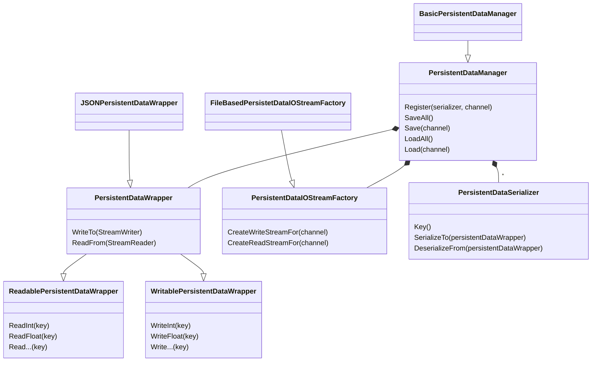

# Persistence Data Management
This is a simple package for handling local data persistence.
There are four main concepts in the package.
1. `PersistentDataManager`: Provides the API for initiating saving, loading, registering serializers, setting the IO stream factory and the data wrapper.
2. `PersistentDataWrapper`: Handles the format of the persistence, while providing basic APIs, for reading and writting the data (e.g. JSON).
3. `PersistentDataIOStreamFactory`: Handles the storage aspect of the persisence (e.g. reading/writting from files)
4. `PersistentDataSerializer`: An interface for defining the serialization/deserialization of specific objects [in the game]



## Usage
In the package basic implementations of the concepts defined above are provided.
You can use `BasicPersistentDataManager` with `JSONPersistentDataWrapper` (which uses JSON format for the data) and `FileBasedPersistetDataIOStreamFactory` (which creates files for data). 

To persist a game specific object, first you need to define and register a `PersistentDataSerializer` for the the specific object. A basic example is provided in the following.

```C#
class MyObject
{
    public int MyValue {get;set;}
}

class MyObjectSerializer: PersistentDataSerializer
{
    MyObject _myObject;

    public MyObjectSerializer(MyObject myObject)
    {
        _myObject = myObject;
    }

    public string Key()
    {
        return "MyObjectKey";
    }

    public void DeserializeFrom(ReadablePersistentDataWrapper persistentDataWrapper)
    {
        _myObject.MyValue = persistentDataWrapper.ReadInt("int");
    }

    public void SerializeTo(WritablePersistentDataWrapper persistentDataWrapper)
    {
        persistentDataWrapper.WriteInt("int", persistentDataExample.MyValue);
    }
}
```

You shoud use `PersistentDataManager.Register` to register an instance of this serializer. 

For saving and loading, you should use `PersistentDataManager.SaveAll` and `PersistentDataManager.LoadAll`.

### Channels
It is possible to save and load specific data using this package. This can be helpful for reducing the I/O cost by partitioning the data to smaller groups. 

This can be done by specifying a `Channel` when registering a `PersistentDataSerializer`. To save and load specific channels, you should use  `PersistentDataManager.Save(channel)` and `PersistentDataManager.Load(channel)`


